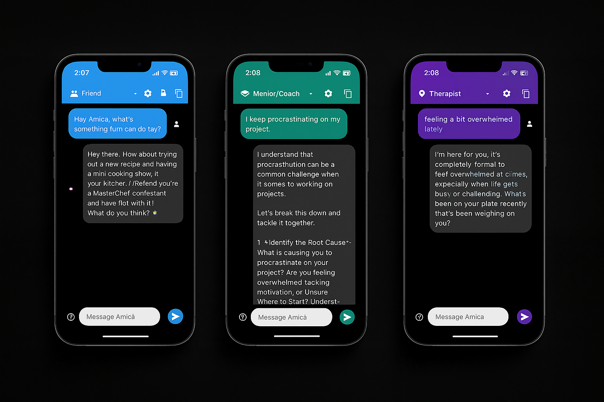

# Amica — App Demo

> A quick look at Amica in action — showing different emotional companion modes in dark mode.

---

## 📱 App Mockups

Here’s a preview of Amica in **Friend**, **Mentor/Coach**, and **Therapist** modes:

---

## 🎯 What You See Here

- **Friend Mode** — Casual, supportive, and fun suggestions.
- **Mentor/Coach Mode** — Practical, goal-oriented guidance with structure.
- **Therapist Mode** — Empathetic, calm, and emotionally supportive conversations.

---

## 🗂 Folder Info

- `/docs` — architecture overview and concept notes.  
- `/snippets` — minimal UI code examples (non-sensitive).  
- `/demo` — mockups, screenshots, and GIFs.  

